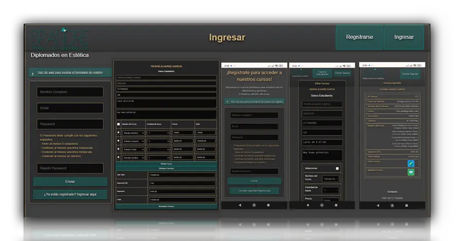

# 📦 Sistema de Facturación Web en PHP


Sistema web desarrollado en PHP que permite gestionar la facturación, usuarios, recuperación de contraseñas y generación de archivos PDF. Ideal para pequeñas empresas o proyectos educativos que requieren un sistema de facturación básico pero funcional.

---

## ✨ Funcionalidades principales

- ✅ Registro e ingreso de usuarios
- 🔐 Recuperación y restablecimiento de contraseñas
- 🧾 Generación, edición y eliminación de facturas
- 📄 Exportación de facturas en PDF (usando DOMPDF)
- 📚 Gestión de cursos y asignación
- 📊 Listado de facturas generadas

---

## 📁 Estructura del proyecto

```
📦 facturacion-web/
├── css/
├── js/
├── img/
├── vendor/          # Librerías externas (ej. dompdf)
├── dompdf/          # Generador de PDF
├── *.php            # Lógica y vistas
├── *.sql            # Scripts de base de datos
└── index.php / index.html
```

---

## 🛠 Tecnologías utilizadas

| Lenguaje / Herramienta | Descripción |
|------------------------|-------------|
| **PHP** | Lógica del servidor, conexión con base de datos |
| **MySQL** | Almacenamiento de datos de usuarios, facturas y cursos |
| **HTML + CSS** | Estructura y estilos de las páginas |
| **JavaScript** | Funciones interactivas básicas |
| **DOMPDF** | Conversión de HTML a PDF para facturas |
| **Git** | Control de versiones y despliegue en GitHub |

---

## 🧪 Cómo instalar localmente

1. Clona este repositorio:

```bash
git clone https://github.com/dienton82/facturacion-web.git
```

2. Crea una base de datos en tu servidor local y carga los archivos `.sql` con phpMyAdmin.

3. Configura tu archivo `conectardb.php` con tus credenciales locales (host, usuario, clave, base de datos).

4. Ejecuta el proyecto en un entorno local como **XAMPP** o **WAMP**.

---

## 📷 Capturas



---

## 🔗 Enlace del proyecto

👉 Repositorio público: [https://github.com/dienton82/facturacion-web](https://github.com/dienton82/facturacion-web)

---

## ✍️ Autor

**Yeison Álvarez**  
Desarrollador Web Full-Stack | Diseño & Desarrollo  
[GitHub](https://github.com/dienton82)  
[Portafolio](https://portafolio-ya.vercel.app)
